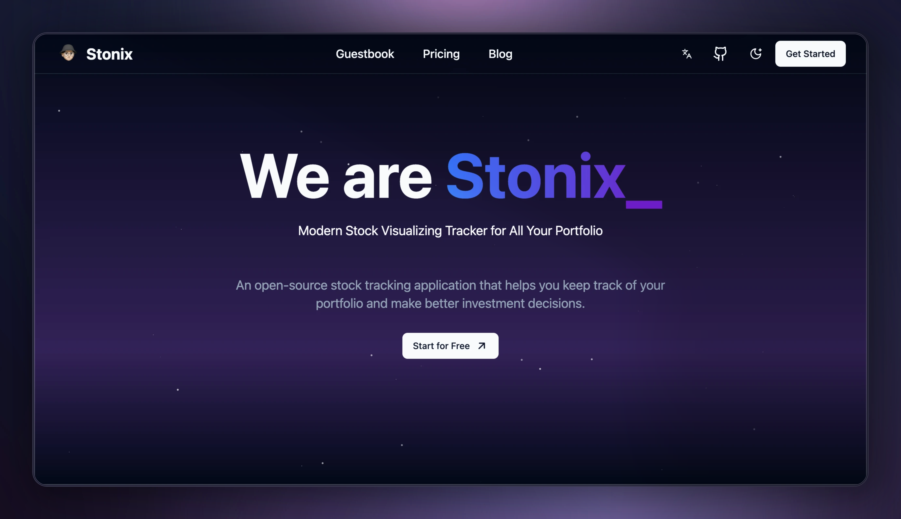

# Stonix

<a name="readme-top"></a>

<a href="https://stonix.1chooo.com">
  
</a>

<p align="center">
  
  
  
  
</p>

<p align="center">
  <strong>
    <a href="#-abstract">📍 Abstract</a>&nbsp;&nbsp;&bull;&nbsp;
    <a href="#-features">✨ Feature</a>&nbsp;&nbsp;&bull;&nbsp;
    <a href="#-contributing">🌏 Contributing</a>&nbsp;&nbsp;&bull;&nbsp;
    <a href="#-contact-info">📲 Contact Info</a>&nbsp;&nbsp;&bull;&nbsp;
    <a href="#-license">🪪 License</a>&nbsp;&nbsp;&bull;&nbsp;
    <a href="https://docs.1chooo.com">📚 Docs</a>
  </strong>
</p>

## 📍 Abstract

💵 Modern Stock Tracking Visualizer for All Your Portfolio

## ✨ Features

## 🌏 Contributing

[PRs](https://github.com/1chooo/stonix/pulls) and [Issues](https://github.com/1chooo/stonix/issues) are welcome! 🫵🏻

Please read the [Contributing Guideline] for details on our code of conduct, and the process for submitting pull requests to us.

[Contributing Guideline]: ./CONTRIBUTING.md

## 🔩 Getting Started

> [!NOTE]
> We choose [`pnpm`](https://pnpm.io/) as our package manager. Make sure you have it installed before running the following commands.

### Clone the Repository

```shell
$ git clone git@github.com:1chooo/stonix.git
$ cd stonix
$ pnpm install
```

### Run the Web App

```shell
$ pnpm run dev
```

Open [http://localhost:3000](http://localhost:3000) with your browser to see the result.

## 📲 Contact Info

> **Hugo ChunHo Lin**
>
> <aside>
>   📩 E-mail: <a href="mailto:hugo970217@gmail.com">hugo970217@gmail.com</a>
> <br>
>   🧳 Linkedin: <a href="https://www.linkedin.com/in/1chooo/">Hugo ChunHo Lin</a>
> <br>
>   👨🏻‍💻 GitHub: <a href="https://github.com/1chooo">1chooo</a>
>    
> </aside>

## 🪪 LICENSE

Released under [MIT](./LICENSE) by [@1chooo](https://1chooo.com)

This software can be modified and reused without restriction. The original license must be included with any copies of this software. If a significant portion of the source code is used, please provide a link back to this repository.

Made with 🖤 by [@1chooo][1chooo-com]

[1chooo-com]: https://1chooo.com

<p align="right" style="font-size: 14px; color: #555; margin-top: 20px;">
    <a href="#readme-top" style="text-decoration: none; color: #007bff; font-weight: bold;">
        ↑ Back to Top ↑
    </a>
</p>
